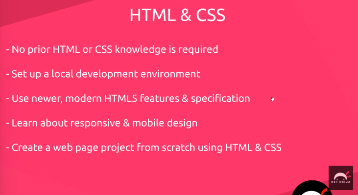
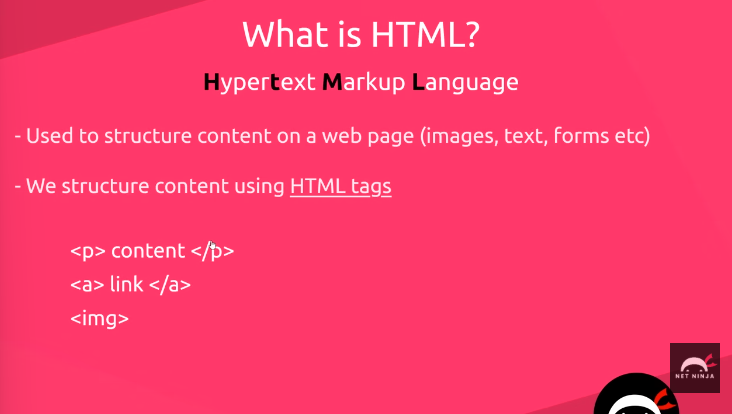
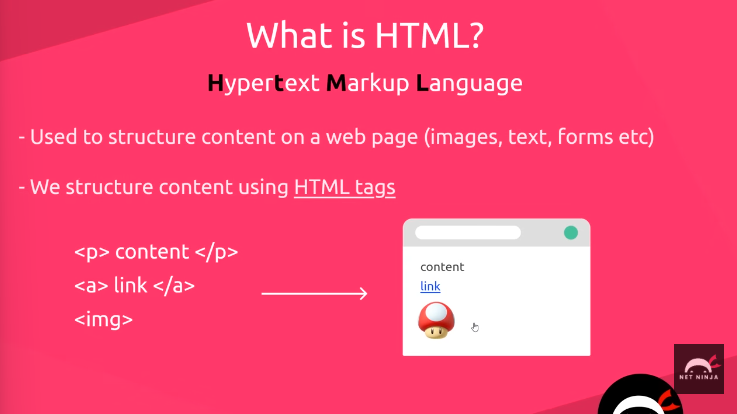
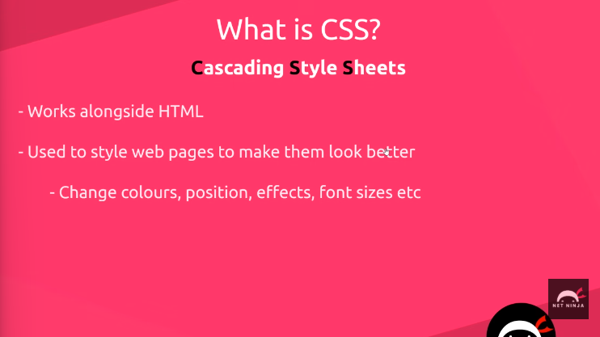
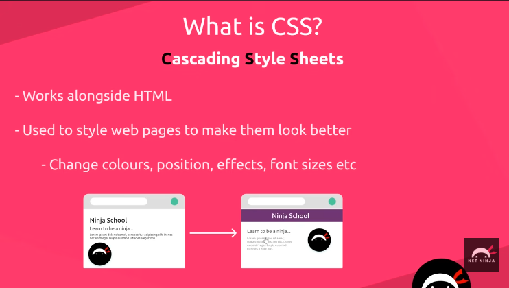
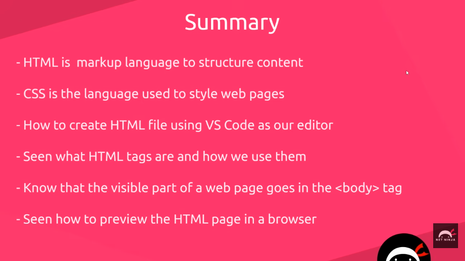
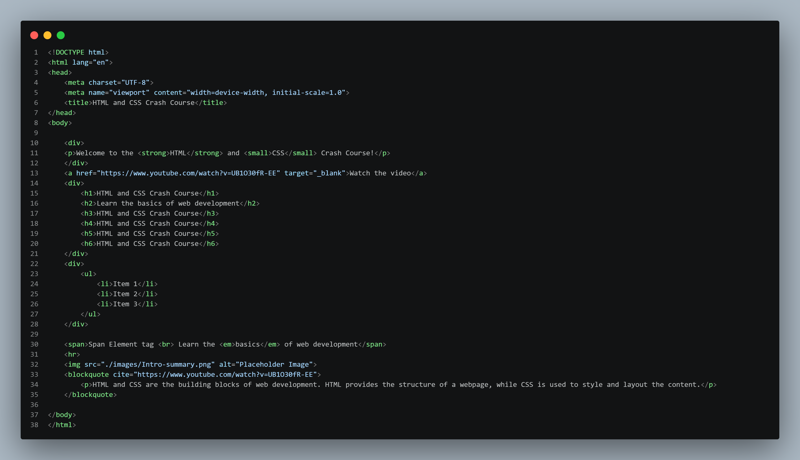
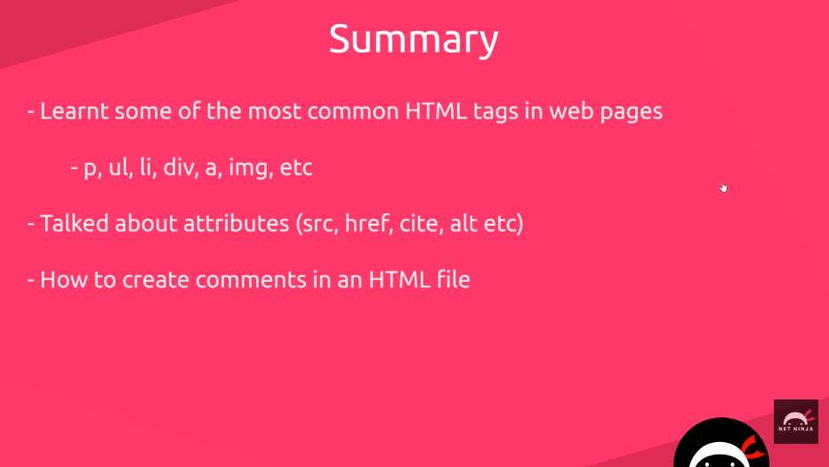

# HTML & CSS Crash Course 
> Tutorial from  [`Net Ninja`](https://www.youtube.com/watch?v=hu-q2zYwEYs&list=PL4cUxeGkcC9ivBf_eKCPIAYXWzLlPAm6G)

### 1. Introduction

#### What is html?

#### What is CSS?

#### Text editor
> Any one option is enough
- Visual Studio Code
- Sublime Text

#### Web Browser
> Any one option is enough
- Google Chrome
- Mozilla Firefox

#### HTML File
- Create an `index.html` file

Structure of the HTML file
`<!DOCTYPE html>` - states that this is an HTML file

##### Server
- Add a `Live Server` to run the file in an `http` protocal for auto refresh in the browser each time a file is saved.
- Add the `Live Server` extension in the Visual Studio Code 

#### Introduction Summary

---
***
___

### 2. HTML Basics

>  Some tags in HTML

| HTML Tag | Usage of the tag | Meaning of the tag |
| -------- | ---------------- | ------------------ |
| `strong` | `<strong> </strong>`   | Makes text Bold   |
| `small`   | `<small> </small>`   | Small text   |
| `em`   | `<em> </em>`   | Makes text Italic   |
| Heading tags (h1 to h6)   | `<h1></h1>` `<h2></h2>` `<h3></h3>` `<h1=4></h4>` `<h5></h5>` `<h6></h6>`  | h1 is the biggest and stongest while h6 is the smallest. The size of the headings reduces from h1, h2, h3, h4, h5 to h6 respectively. The larger the h number, the least the importance.   |
| `<a>`   | `<a href="">`   | Create an anchor link   |
| `ul`   |  `<ul></ul>`   | Unordered list and the tag has `<li> </li>`   |
| `div`   | `
 
`   |  Markout different sections into groups  |
| `span`   | ` `  | A way to add a CSS or JS hook   |
| `br`   | ` `   | Line break   |
| `hr`   | `
`   | Horizontal rule - adds a bottom line. It's a self-closing tag  |
| `img`   | ``  | Add images. It's a self-closing tag  |
| `blockquote`   | `<blockquote cite=""> </blockquote>`   | Quote something from another website   |
| Cell 1   | Cell 2   | Cell 2   |
| Cell 4   | Cell 5   | Cell 2   |
| Cell 1   | Cell 2   | Cell 2   |
| Cell 4   | Cell 5   | Cell 2   |
| Cell 1   | Cell 2   | Cell 2   |
| Cell 4   | Cell 5   | Cell 2   |

### HTML Forms

> We use web forms to capture user information e.g. login form captures user credentials, contact form captures user email, messages, etc

### CSS Basics

### CSS Classes and Selectors

### HTML 5 Semantics

### Chrome Dev Tools

### CSS Layout & Position

### Pseudo Classes and Elements

